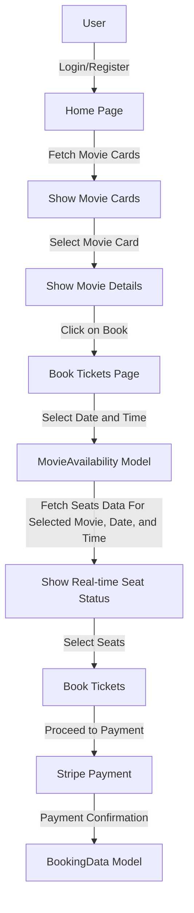

# 🎥 CineView - Secure Movie Booking System

**CineView** is an advanced movie ticket booking system designed to provide users with a seamless and secure experience. Featuring real-time seat updates, secure payment processing via Stripe, and a robust booking management system, CineView ensures a smooth user journey from movie browsing to ticket booking.

This project utilizes **Django REST Framework** for backend development, **React** and **Vite** for frontend, and **Tailwind CSS** for elegant UI styling. It also includes a **Stripe** payment gateway integration managed by a separate Express.js server.

## 🎥 Video Overview

[Watch the Video](https://github.com/user-attachments/assets/eaf83c93-2bb5-4884-aa30-5fbba85ba2c4)

---

## 📁 Project Structure

The project consists of the following Django apps:

1. **api**: Manages user data (authentication and registration).
2. **BookingDetails**: Stores all booking-related information.
3. **SeatDetails**: Tracks seat availability and updates seat reservation statuses in real-time.

**Servers in use**:

- **Django** - Backend API.
- **React** - Frontend (Vite for build).
- **Stripe Server** - Payment gateway using Express.js.

---

## ⚙️ Tech Stack

- **Frontend**: React, Vite, Tailwind CSS
- **Backend**: Django REST Framework
- **Payment Gateway**: Stripe (Express.js Server)
- **Database**: SQLite (development)

---

## 🎯 Key Features

- **Movie Browsing**: Browse through a list of available movies with details on date and time slots.
- **Search Functionality**: Users can search for movies, with appropriate messaging for no results found.
- **Secure User Authentication**: Users must register and log in to book tickets.
- **Real-time Seat Updates**: Updates seat availability in real-time to prevent overbookings.
- **Stripe Integration**: Secure payment processing with a clear flow for success and cancellation cases.
- **Booking History**: Users can view their booking history and download tickets or receipts.
---

## 🗂️ Data Models Overview

### `api/models.py` - User Data
```python
from django.db import models

class UserData(models.Model):
    name = models.CharField(max_length=30)
    email = models.EmailField(unique=True)
    password = models.CharField(max_length=128)
```

### `BookingDetails/models.py` - Booking Data
```python
from django.db import models

class BookingData(models.Model):
    email = models.EmailField()  # Customer email
    movie_name = models.CharField(max_length=255)
    date = models.CharField(max_length=50)
    time_slot = models.CharField(max_length=50)
    seat_number = models.CharField(max_length=255)
    amount = models.IntegerField()
```

### `SeatDetails/models.py` - Seat Availability
```python
from django.db import models

class MovieAvailability(models.Model):
    movie_name = models.CharField(max_length=255)
    date = models.CharField(max_length=30)
    time_slot = models.CharField(max_length=20)
    seat_status = models.CharField(max_length=30)  # Seat reservation status
```

---

## 📊 Visual Workflow Diagram

The following diagram outlines the workflow from user authentication and movie browsing, to seat selection, booking, and payment via Stripe.



---

## 🚀 Features & Usage

1. **Movie Search**: Users can search for movies. If the movie exists, it will display available dates and time slots; otherwise, a "No results found" message is shown.
2. **Seat Selection**: Users must select both a date and a time slot before booking. If a time slot isn't selected, the system prompts users to select one.
3. **Secure Payment**: Users can securely pay via Stripe. If the payment is successful, booking details are saved, and users can download their tickets and receipts.
4. **Error Handling**: If the payment fails or is canceled, the system redirects the user to a cancellation page, and no booking is saved.

---

## 🛠️ Setup & Installation

### Clone the repository:

```bash
git clone https://github.com/Khushal-Savalakha/CineView-Secure-Movie-Booking.git
```

### Backend Setup (Django):

1. **Navigate to the backend directory and Install dependencies**:
   ```bash
   cd Backend
   ```

2. **Run database migrations**:
   ```bash
   python manage.py migrate
   ```
3. **Start the Django development server**:
   ```bash
   python manage.py runserver
   ```

### Frontend Setup (React):

1. **Navigate to the frontend directory**:
   ```bash
   cd Frontend
   ```
2. **Install npm dependencies**:
   ```bash
   npm install
   ```
3. **Start the React development server (Vite)**:
   ```bash
   npm run dev
   ```

### Stripe Server Setup:

1. **Navigate to the stripe-server directory**:
   ```bash
   cd Stripe-Server
   ```
2. **Install dependencies**:
   ```bash
   npm install
   ```
3. **Start the Express.js server**:
   ```bash
   node index.js
   ```


## 🌐 Payment Flow with Stripe

The payment process is securely managed via Stripe. If a user completes a booking, the payment details are saved, and the user is shown a success page. If the payment fails or is canceled, they are redirected to a cancellation page.

- **Success URL**: Displays a confirmation message and provides the option to download the booking receipt.
- **Cancel URL**: Redirects to a page displaying an apology message, offering to return to the booking history.

---

## 📄 Booking History


Once a ticket is successfully booked, users can view their booking history.

---

## 🧩 Future Improvements

- **Movie Reviews**: Allow users to review and rate movies.
- **Refund Management**: Implement a refund process for ticket cancellations.
- **Admin Dashboard**: Provide advanced controls for admins to manage movies, bookings, and user data.


---

Enjoy a secure and seamless movie booking experience with **CineView**! 🎬🍿


